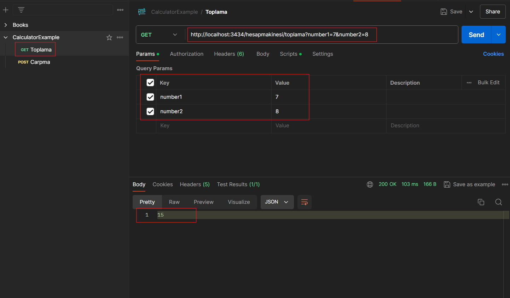
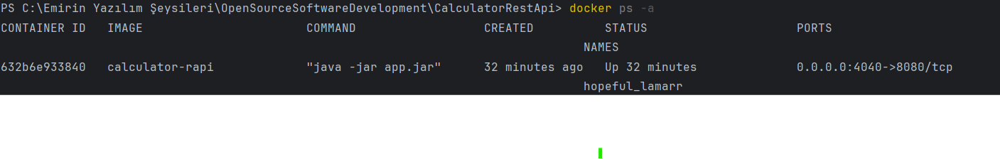
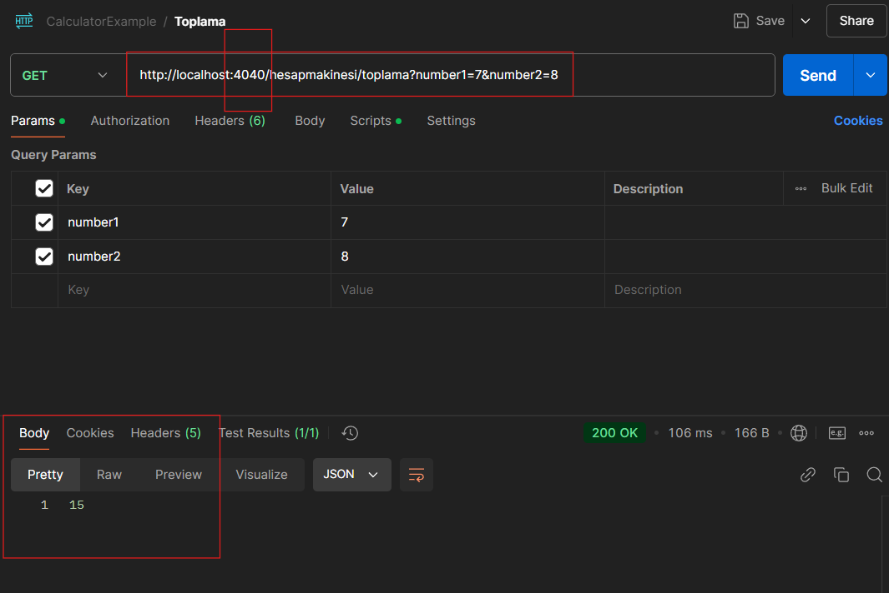

### REST APİ İLE HESAP MAKİNESİ 

- Uygulamanın api testleri postman aracılığı ile yapılmıştır

- Ana url `http://localhost:3434/hesapmakinesi` olup toplama iki farklı endpoint ile 
çarpma ve toplama işlemleri yapılmaktadır 

- Aşağıda ise uygulamanın postman ile çalıştırılıp test edildiğine dair görselleri mevcuttur

#### GET İSTEĞİ POSTMAN İLE APİ TESTİ :



#### POST İSTEĞİ POSTMAN İLE APİ TESTİ :


### DEBİAN VE SERVİS PAKETİ OLUŞTURMA 

1.1. Servis paketi

WSL terminalini açın ve projenizin kök dizinine gidin

wsl de açılan işletim sistemi tabanı için terminale 

````properties
cd /mnt/c/Emirin\ Yazılım\ Şeysileri/OpenSourceSoftwareDevelopment/CalculatorRestApi
````

````properties
./mvnw clean package


````

Bu işlemlerden sonra ise dizin oluşturup

````properties
mkdir -p calculator
````

jar dosyasını dizine kopyalıyoruz
````properties
cp target/CalculatorRestApi-0.0.1-SNAPSHOT.jar ./calculator/
````

ardından kök dizine dönüp bash'e yazıyoruz : 

````properties
nano calculator.service
````

servis dosyasını yapılandırıyoruz (servis dosyasının içine)

````properties
[Unit]
Description=Calculator REST API  
After=network.target  

[Service]
Restart=on-failure  
ExecStart=/usr/bin/java -jar /mnt/c/Emirin\ Yazılım\ Şeysileri/OpenSourceSoftwareDevelopment/CalculatorRestApi/calculator/Calculator-0.0.1-SNAPSHOT.jar  
User=emiryilmaz4144
Environment=SPRING_APPLICATION_JSON='{"spring.application.name":"Calculator","server.port":3434}'  
StandardOutput=journal  
StandardError=journal  

[Install]
WantedBy=multi-user.target
````

yazıyor ve servisi yüklemek için 

````properties
sudo mv calculator.service /etc/systemd/system/
````

dedikten sonra servisi başlatmak ve etkinleştirmek için 

````properties
sudo systemctl daemon-reload  
sudo systemctl start calculator  
sudo systemctl enable calculator
````

servis durumu kontrolü : 

````properties
sudo systemctl status calculator
````
1.1. Debian paketi

gereksinimleri yükleme
````properties
sudo apt-get install checkinstall
````

paketi oluşturma 

````properties
sudo checkinstall --pkgname=calculator --pkgversion="0.0.1" --backup=no --deldoc=no --install=no maven install:install
````
paketi kurma 

````properties
sudo dpkg -i calculator_0.0.1-1_amd64.deb
````

Sonuç olarak, yukarıdaki adımları 
tamamladıktan sonra projeniz calculator 
altında bulunacak ve systemd 
servisi olarak yönetilecektir. 
Ayrıca, .deb paketiniz ile başka 
sistemlere de dağıtım yapabilirsiniz.

<hr>
<hr>
<hr>

### DOCKER-IMAGE VE DOCKER-COMPOSE İLE CONTEİNER SERVİS OLUŞTURMA

Uygulamamızı docker conteiner ile ayağa kaldırmak için
ve dışarıdan erişilebilir bir port ile erişmek için aşağıdaki
adımlar izlenebilir 

1. Dockerfile içerisine kullanılan programlama dilinin
image'ini alırız (java için openjdk'nın kullanılan versiyonu:openjdk22)

2. Çalışma dizini ayarlanır (app)
3. terminalde ``mvn package`` komutu çalışıtırılarak target klasöründe
oluşan jar dosyasının kopyası alınarak dockerfile'a bildirirlir ve istenilen ad
verilir
4. Uygulamanın çalışması için programlama dili , ne tür dosya üzerinde çalışıldığı ve 
çalışılınan dosyaya verilen ad entrypoint olarak verilir

(Aşağıda toplu hal verilmiştir)

````properties

# Base image olarak OpenJDK 22 kullanıyoruz
FROM openjdk:22-jdk-slim

# Çalışma dizinini ayarlıyoruz
WORKDIR /app

# Jar dosyasını kopyalıyoruz
COPY target/CalculatorRestApi-0.0.1-SNAPSHOT.jar app.jar

# Uygulamayı çalıştırıyoruz
ENTRYPOINT ["java", "-jar", "app.jar"]

````

#### Docker İmajı Oluşturma

Dockerfile yazıldıktan sonra çalıştırmak için terminalde: 

````properties
docker build -t calculator-rapi
````
komutu yazılır (calculator-rest-api burada benim atadığım image ismidir
siz kendi istediğiniz ismi koyabilirsiniz )

Bu adımdan sonra ise image'in konteynırını oluşturmak ve çalıştırmak için : 

````properties
docker run -p 4040:8080 calculator-rapi
````

komutu çalıştırılır burada 8080 portu uygulamanın çalıştığı porttur
4040 portu ise konteynırın 8080 portundaki uygulamayı çalıştırabilmemiz
için dış dünyadan uygulamaya erişmemizi sağlayan porttur 

Uygulamamızın çalıp çalışmadığını ve konteynırın ayakta olup olmadığının 
kontrolü ise 

````properties
docker ps -a 
````
komutu ile kontrol edilebilir aşağıdaki gibi bir çıktı
alırsanız konteynırınız başarılı ile ayağa kaldırılmış demektir: 



Postman ile test işlemini gerçekleştirelim



Yukarıdaki resimdende anlaşılacağı üzere normalde 8080 portunda
çalışan uygulama docker konteynır ile 4040 portundan erişilebilir hale
gelmiş ve bu port üzerinden işlemler gerçekleştirilmiştir.


#### DOCKER-COMPOSE DOSYASI OLUŞTURMA 

docker-compose.yaml dosyası ile birden fazla 
konteynır ve imaj, servisler aracılığıyla yönetilip, tek bir dosya üzerinden çalıştırılabilir. 

Aşağıdaki örnek yaml dosyası ile bunun nasıl yapılacağı anlatılmıştır

````properties
version: '3.8'

services:
  calculator:
  image: calculator-rapi # Docker imajımızın adı
  build: .  # Dockerfile'ın bulunduğu dizin
  ports:
  - "3434:8080"  # Konteynerdeki 8080 portunu, dışarıya 3434 portu üzerinden erişilebilir yapıyoruz
  volumes:
  - OpenSourceSoftwareDevelopment/CalculatorRestApi:/app  # Yerel klasörü GitHub repo klasörü ile bağlamak için. GitHub'dan ilgili repo indirilecek
  environment:
  - SPRING_PROFILES_ACTIVE=default
  restart: always  # Konteynerin bir hata sonrası otomatik olarak yeniden başlatılmasını sağlar


````

1. `services` ile her bir servisi tanımlarız (burada calculator servisi oluşturup tanımlıyoruz)

2. tanımlanan servislere ait imajın ne olduğunu yapılma türünü ve hangi port ile dış dünyadan 
erişilebileceği bilgisini sırasıyla `image` ,`build`, `ports` alanlarında belirtiriz

3. Githubdaki repo ile volume bağlantısını sağlamak için `volumes` bölümünün altına
<u>
ilgili github reposundan clonelanan projenin klonlondığı dosya yolunu veya zaten githubla entegre çalışan projenin
localdeki dosya yolunu belirtiriz
</u>

4. tüm bu adımlardan sonra ise 
````properties
docker-compose up 
````
komutu ile yaml dosyası başlatılır ve servisler çalıştırılır